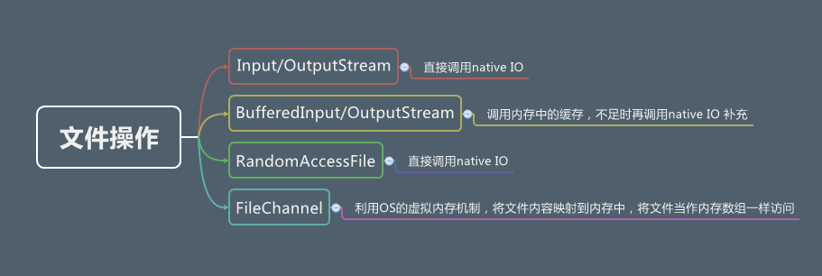

对于socket的文件描述符才有所谓BIO和NIO。
# IO-同步阻塞
Java 的 I/O 大概可以分成以下几类：
磁盘操作：File
字节操作：InputStream 和 OutputStream
字符操作：Reader 和 Writer
对象操作：Serializable
## 网络操作：Socket
ServerSocket：服务器端类
Socket：客户端类
服务器和客户端通过 InputStream 和 OutputStream 进行输入输出。

# NIO-同步非阻塞
[nio系列](http://ifeve.com/overview/)
### 流与块
I/O 与 NIO 最重要的区别是数据打包和传输的方式，I/O 以流的方式处理数据，而 NIO 以块的方式处理数据。
- 面向流的 I/O 
一次处理一个字节数据：一个输入流产生一个字节数据，一个输出流消费一个字节数据。
优点:为流式数据创建过滤器非常容易，链接几个过滤器，以便每个过滤器只负责复杂处理机制的一部分。
缺点:不利的一面是，面向流的 I/O 通常相当慢。
- 面向块的 I/O
优点:一次处理一个数据块，按块处理数据比按流处理数据要快得多。
缺点:但是面向块的 I/O 缺少一些面向流的 I/O 所具有的优雅性和简单性。

I/O 包和 NIO 已经很好地集成了，java.io.* 已经以 NIO 为基础重新实现了，所以现在它可以利用 NIO 的一些特性。例如，java.io.* 包中的一些类包含以块的形式读写数据的方法，这使得即使在面向流的系统中，处理速度也会更快。

- BIO和NIO的区别是什么呢？

在BIO模式下，调用read，如果发现没数据已经到达，就会**Block**住。

在NIO模式下，调用read，如果发现没数据已经到达，就会**立刻返回-1**, 并且errno被设为*EAGAIN*。

## NIO类库简介
[引用](https://www.cnblogs.com/wade-luffy/p/6164668.html)

### 缓冲区buffer
>> Buffer是一个对象，它包含一些要写入或者要读出的数据。在NIO类库中加入Buffer对象，体现了新库与原I/O的一个重要区别。在面向流的I/O中，可以将数据直接写入或者将数据直接读到Stream对象中。
### 通道channel
>> Channel是一个通道，可以通过它读取和写入数据，它就像自来水管一样，网络数据通过Channel读取和写入。
通道与流的不同之处在于通道是双向的，流只是在一个方向上移动（一个流必须是InputStream或者OutputStream的子类），而且通道可以用于读、写或者同时用于读写。
### 多路复用器selector:主要用于网络非阻塞通信（实现原理是epoll）
>> 多路复用器提供选择已经就绪的任务的能力。简单来讲，Selector会不断地轮询注册在其上的Channel，如果某个Channel上面有新的TCP连接接入、读和写事件，这个Channel就处于就绪状态，会被Selector轮询出来，然后通过SelectionKey可以获取就绪Channel的集合，进行后续的I/O操作。

一个多路复用器Selector可以同时轮询多个Channel，由于JDK使用了epoll()代替传统的select实现，所以它并没有最大连接句柄1024/2048的限制。这也就意味着只需要一个线程负责Selector的轮询，就可以接入成千上万的客户端，这确实是个非常巨大的进步。

#### IO多路复用和NIO的关系
IO多路复用是要和NIO一起使用的。尽管在**操作系统级别，NIO和IO多路复用是两个相对独立的事情**。
NIO仅仅是指IO API总是能立刻返回，不会被Blocking；而IO多路复用仅仅是操作系统提供的一种便利的通知机制。
操作系统并不会强制这俩必须得一起用——你可以用NIO，但不用IO多路复用；也可以只用IO多路复用 + BIO，这时效果还是当前线程被卡住。但是，IO多路复用和NIO是要配合一起使用才有实际意义。因此，在使用IO多路复用之前，请总是先把fd设为O_NONBLOCK。
#### IO多路复用器的特征：
 1. IO多路复用说的是多个Socket，只不过操作系统是一起监听他们的事件而已；
 2. IO多路复用的关键API调用(select，poll，epoll_wait）总是Block的；
 3. IO本身（网络数据的收发）无论用不用IO多路复用和NIO，都没有变化。请求的数据该是多少还是多少；网络上该传输多少数据还是多少数据。IO多路复用和NIO一起仅仅是**解决了调度的问题**，避免CPU在这个过程中的浪费，使系统的瓶颈更容易触达到网络带宽，而非CPU或者内存。要提高IO吞吐，还是提高硬件的容量（例如，用支持更大带宽的网线、网卡和交换机）和依靠并发传输（例如HDFS的数据多副本并发传输）。

### epoll
epoll可以理解为event poll，不同于忙轮询(while)和无差别轮询(select:O(n))，epoll会把哪个流发生了怎样的I/O事件通知我们。此时我们对这些流的操作都是有意义的。（复杂度降低到了O(1)）

在讨论epoll的实现细节之前，先把epoll的相关操作列出：
epoll_create 创建一个epoll对象，一般epollfd = epoll_create()
epoll_ctl （epoll_add/epoll_del的合体），往epoll对象中增加/删除某一个流的某一个事件
比如
epoll_ctl(epollfd, EPOLL_CTL_ADD, socket, EPOLLIN);//注册缓冲区非空事件，即有数据流入
epoll_ctl(epollfd, EPOLL_CTL_DEL, socket, EPOLLOUT);//注册缓冲区非满事件，即流可以被写入
epoll_wait(epollfd,...)等待直到注册的事件发生

（注：当对一个非阻塞流的读写发生缓冲区满或缓冲区空，write/read会返回-1，并设置errno=EAGAIN。**而epoll只关心缓冲区非满和缓冲区非空事件**）。

#### 使用NIO编程的优点总结如下。
* 1. 客户端发起的连接操作是异步的，可以通过在多路复用器注册OP_CONNECT等待后续结果，不需要像之前的客户端那样被同步阻塞。
* 2. SocketChannel的读写操作都是异步的，如果没有可读写的数据它不会同步等待，直接返回，这样I/O通信线程就可以处理其他的链路，不需要同步等待这个链路可用。
* 3. 线程模型的优化：由于JDK的Selector在Linux等主流操作系统上通过epoll实现，它没有连接句柄数的限制（只受限于操作系统的最大句柄数或者对单个进程的句柄限制），这意味着一个Selector线程可以同时处理成千上万个客户端连接，而且性能不会随着客户端的增加而线性下降，因此，它非常适合做高性能、高负载的网络服务器。

## AIO-异步非阻塞
JDK1.7升级了NIO类库，升级后的NIO类库被称为NIO2.0，引人注目的是，Java正式提供了异步文件I/O操作，同时提供了与UNIX网络编程事件驱动I/O对应的AIO。

### 内存映射
[原理](https://blog.csdn.net/yusiguyuan/article/details/2338877)
 >> 内存映射，简而言之就是将**用户空间**的一段内存区域**映射到内核空间**，映射成功后，用户对这段内存区域的修改可以直接反映到内核空间，同样，内核空间对这段区域的修改也直接反映用户空间。那么对于内核空间<---->用户空间两者之间需要大量数据传输等操作的话效率是非常高的。

>> 内存映射文件：内存映射文件允许我们创建和修改那些因为太大而不能放入内存的文件，此时就可以假定整个文件都放在内存(虚拟内存)中，而且可以完全把它当成非常大的数组来访问（随机访问）

nio使内存映射文件变得简单：[参考](https://www.cnblogs.com/ixenos/p/5863921.html)

## Netty
Netty是一个高性能 事件驱动的异步的非堵塞的IO(NIO)框架，用于建立TCP等底层的连接，基于Netty可以建立高性能的Http服务器。支持HTTP、 WebSocket 、Protobuf、 Binary TCP |和UDP，Netty已经被很多高性能项目作为其Socket底层基础，如HornetQ Infinispan Vert.x
Play Framework Finangle和 Cassandra。其竞争对手是：Apache MINA和 Grizzly。

Netty原理和使用：https://www.jdon.com/concurrent/netty.html
IO和NIO对比：https://www.jianshu.com/p/a4e03835921a
http://www.sohu.com/a/272879207_463994
