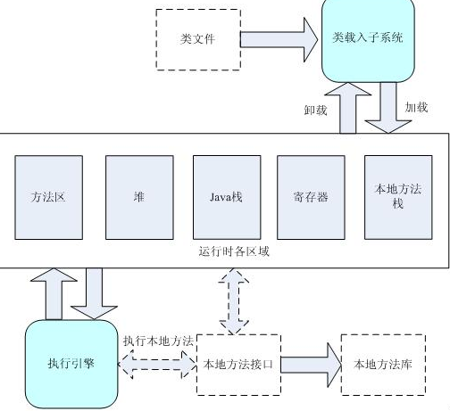

todo  补上基础知识
https://github.com/Snailclimb/JavaGuide/blob/master/Java%E7%9B%B8%E5%85%B3/Java%E5%9F%BA%E7%A1%80%E7%9F%A5%E8%AF%86.md


# 面向对象开发原则SOLID原则
1. S：单一责任原则，如果你的代码中有一个类行数太长，可能你需要重新审视一下，是不是这个类承担了过多的责任。
2. O：开放关闭原则，对扩展开放，对修改关闭。由于对于代码的直接修改是非常危险的事情，因为你不知道这段代码原来被谁用了，因此不要贸然修改一段代码，而是选择用接口进行调用，用实现进行扩展的方式进行。
3. L：里氏替换原则，如果基于接口进行编程，则子类一定要能够扩展父类的功能，如果不能，说明不应该继承与这个接口。例如你的实现的时候，发现接口中有一个方法在你这里实在对应不到实现，不是接口设计的问题，就是你不应该继承这个接口，绝不能出现not implemented类似之类的实现方法。
4. I：接口隔离原则，接口不应该设计的大而全，一个接口暴露出所有的功能，从而使得客户端依赖了自己不需要的接口或者接口的方法。而是应该讲接口进行细分和提取，而不应该将太过灵活的参数和变量混杂在一个接口中。
5. D：依赖倒置原则，A模块依赖于B模块，B模块有了修改，反而要改A，就是依赖的过于紧密的问题。这就是常说的，你变了，我没变，为啥我要改。如果基于抽象的接口编程，将修改隐藏在后面，则能够实现依赖的解耦。


[类的实例化过程](https://blog.csdn.net/justloveyou_/article/details/72466416)
# 一 基本类型
byte：Java中最小的数据类型，在内存中占8位(bit)，即1个字节，取值范围-128~127，默认值0 \
short：短整型，在内存中占16位，即2个字节，取值范围-32768~32767，默认值0 \
int：整型，用于存储整数，在内存中占32位，即4个字节，取值范围-2147483648~2147483647，默认值0 \
long：长整型，在内存中占64位，即8个字节-2^63~2^63-1，默认值0L \
float：浮点型，在内存中占32位，即4个字节，用于存储带小数点的数字（与double的区别在于float类型有效小数点只有6~7位），默认值0 \
double：双精度浮点型，用于存储带有小数点的数字，在内存中占64位，即8个字节，默认值0 \
- float和double内存二进制区别
float：
符号位（1 bit）	指数（8 bit）	尾数（23 bit）
double：
符号位（1 **bit**）	指数（11 bit）	尾数（52 bit）
tips:**从左到右是从低位到高位，而在计算机内部是采用逆序存储的。**

char：字符型，用于存储单个字符，占16位，即2个字节，取值范围0~65535，默认值为空 \
boolean：布尔类型，占1个字节，用于判断真或假（仅有两个值，即true、false），默认值false

[编码](https://www.cnblogs.com/yaya-yaya/p/5768616.html)
- UTF-8 有以下编码规则： 
1. 如果一个字节，最高位（第 8 位）为 0，表示这是一个 ASCII 字符（00 - 7F）。可见，所有 ASCII 编码已经是 UTF-8 了。 
2. 如果一个字节，以 11 开头，**连续的1的个数暗示这个字符的字节数，例如：110xxxxx 代表它是双字节 UTF-8 字符的首字节。**
3. 如果一个字节，以 10 开始，表示它不是首字节，需要向前查找才能得到当前字符的首字节 

## 缓存池
new Integer(123) 与 Integer.valueOf(123) 的区别在于：
new Integer(123) 每次都会新建一个对象；
Integer.valueOf(123) 会使用缓存池中的对象，多次调用会取得同一个对象的引用。
在 Java 8 中，Integer 缓存池的大小默认为 -128~127。
```java
public static Integer valueOf(int i) {
    if (i >= IntegerCache.low && i <= IntegerCache.high)
        return IntegerCache.cache[i + (-IntegerCache.low)];
    return new Integer(i);
}
```
* tips:
基本类型对应的缓冲池如下：
boolean values true and false
all byte values
short values between -128 and 127
int values between -128 and 127
char in the range \u0000 to \u007F

# Java关键字
## final

## static
## this
## super

# 反射
>> Reflection:Java反射机制是在运行状态中，对于任意一个类，都能够知道这个类的所有属性和方法；对于任意一个对象，都能够调用它的任意一个方法和属性；这种动态获取的信息以及动态调用对象的方法的功能称为Java语言的反射机制。
* 反射机制获取类有三种方法 
1. 直接通过类名.class的方式得到(一个类只会被反射出来一次)
Class clazz = Person.class;
2. 通过对象的getClass()方法获取(较少使用)
Object obj = new Person();
Class clazz = obj.getClass();
3. 通过全类名获取，用的就较多
Class clazz = Class.forName("com.test.Person");

>> 关于Class
1. Class是一个类，一个描述类的类（也就是描述类本身），封装了描述方法的Method，描述字段的Filed，描述构造器的Constructor等属性
2. 对象照镜子后（反射）可以得到的信息：某个类的数据成员名、方法和构造器、某个类到底实现了哪些接口。
3. 对于每个类而言，JRE 都为其保留一个不变的 Class 类型的对象。 一个 Class 对象包含了特定某个类的有关信息。
4. Class 对象只能由系统建立对象
5. **一个类在 JVM 中只会有一个Class实例**


#类加载机制
[类加载详解](http://www.cnblogs.com/ityouknow/p/5603287.html)

## 什么是类加载
>> 类的加载指的是将类的.class文件中的二进制数据读入到内存中，将其放在运行时数据区的**方法区**内，然后在**堆区**创建一个java.lang.Class对象，用来封装类在方法区内的数据结构。类的加载的最终产品是位于堆区中的Class对象，Class对象封装了类在方法区内的数据结构，并且向Java程序员提供了访问方法区内的数据结构的接口。

## 类的生命周期

>> 其中类加载的过程包括了加载、验证、准备、解析、初始化五个阶段。在这五个阶段中，加载、验证、准备和初始化这四个阶段发生的顺序是确定的，而解析阶段则不一定，它在某些情况下可以在初始化阶段之后开始，这是为了支持Java语言的运行时绑定（也称为动态绑定或晚期绑定）。另外注意这里的几个阶段是按顺序开始，而不是按顺序进行或完成，因为这些阶段通常都是互相交叉地混合进行的，通常在一个阶段执行的过程中调用或激活另一个阶段。


## 类加载器

   - 启动类加载器：Bootstrap ClassLoader: 负责加载存放在**JDK\jre\lib**(JDK代表JDK的安装目录，下同)下，或被-Xbootclasspath参数指定的路径中的，并且能被虚拟机识别的类库（如rt.jar，所有的java.*开头的类均被Bootstrap ClassLoader加载）。启动类加载器是无法被Java程序直接引用的。

   - 扩展类加载器：Extension ClassLoader: 该加载器由sun.misc.Launcher$ExtClassLoader实现，它负责加载**JDK\jre\lib\ext**目录中，或者由java.ext.dirs系统变量指定的路径中的所有类库（如javax.*开头的类），开发者可以直接使用扩展类加载器。

   - 应用程序类加载器：Application ClassLoader，该类加载器由sun.misc.Launcher$AppClassLoader来实现，它负责加载**用户类路径（ClassPath）所指定的类**，开发者可以直接使用该类加载器，如果应用程序中没有自定义过自己的类加载器，一般情况下这个就是程序中默认的类加载器。
   - 用户自定义加载器：User ClassLoader


## 双亲委派模型
1. 当AppClassLoader加载一个class时，它首先不会自己去尝试加载这个类，而是把类加载请求委派给父类加载器ExtClassLoader去完成。
2. 当ExtClassLoader加载一个class时，它首先也不会自己去尝试加载这个类，而是把类加载请求委派给BootStrapClassLoader去完成。
3. 如果BootStrapClassLoader加载失败（例如在$JAVA_HOME/jre/lib里未查找到该class），会使用ExtClassLoader来尝试加载；
4. 若ExtClassLoader也加载失败，则会使用AppClassLoader来加载，如果AppClassLoader也加载失败，则会报出异常ClassNotFoundException。

- 双亲委派模型意义：
  - 系统类防止内存中出现多份同样的字节码
  - 保证Java程序安全稳定运行

# 代理
>> 代理(Proxy)是一种设计模式,提供了对目标对象另外的访问方式;即通过代理对象访问目标对象.这样做的好处是:可以在目标对象实现的基础上,增强额外的功能操作,即扩展目标对象的功能.
>>> 代理模式的关键点是:代理对象与目标对象.代理对象是对目标对象的扩展,并会调用目标对象

[代理模式参考链接](https://www.cnblogs.com/cenyu/p/6289209.html)

## 静态代理
* 静态代理在使用时,*需要定义接口或者父类*,被代理对象与代理对象一起实现相同的接口或者是继承相同父类.

* 静态代理总结:
1.可以做到在不修改目标对象的功能前提下,对目标功能扩展.
2.缺点:因为代理对象需要与目标对象实现一样的接口,所以会有很多代理类,类太多.
同时,一旦接口增加方法,目标对象与代理对象都要维护.

## 动态代理---基于jvm反射实现
* 动态代理有以下特点:
1. 代理对象,不需要实现接口
2. 代理对象的生成,是利用JDK的API,动态的在内存中构建代理对象(需要我们指定创建代理对象/目标对象实现的接口的类型)
3. 动态代理也叫做:JDK代理,接口代理

* 代理类所在包:java.lang.reflect.Proxy
JDK实现代理只需要使用newProxyInstance方法,但是该方法需要接收三个参数,完整的写法是:
 ``` java
 static Object newProxyInstance(ClassLoader loader, Class<?>[] interfaces,InvocationHandler h )
 ```
 >> 注意该方法是在Proxy类中是静态方法,且接收的三个参数依次为:
>>> ClassLoader loader,:指定当前目标对象使用类加载器,获取加载器的方法是固定的
>>> Class<?>[] interfaces,:目标对象实现的接口的类型,使用泛型方式确认类型
>>> InvocationHandler h:事件处理,执行目标对象的方法时,会触发事件处理器的方法,会把当前执行目标对象的方法作为参数传入

* 总结:
代理对象不需要实现接口,但是目标对象一定要实现接口,否则不能用动态代理

## Cglib代理--实现原理：FastClass对Class对象进行特别的处理，比如将会用数组保存method的引用，每次调用方法的时候都是通过一个index下标来保持对方法的引用。
上面的静态代理和动态代理模式都是*要求目标对象是实现一个接口的目标对象*,但是有时候目标对象只是一个单独的对象,并没有实现任何的接口,这个时候就可以使用以目标对象子类的方式类实现代理,这种方法就叫做:Cglib代理

>> Cglib代理,也**叫作子类代理**,它是在内存中构建一个子类对象从而实现对目标对象功能的扩展.
* JDK的动态代理有一个限制,就是使用动态代理的对象必须实现一个或多个接口,如果想代理没有实现接口的类,就可以使用Cglib实现.
* Cglib是一个强大的高性能的代码生成包,它可以在运行期扩展java类与实现java接口.它广泛的被许多AOP的框架使用,例如Spring AOP和synaop,为他们提供方法的interception(拦截)
* Cglib包的底层是通过使用一个小而快的字节码处理框架ASM来转换字节码并生成新的类.不鼓励直接使用ASM,因为它要求你必须对JVM内部结构包括class文件的格式和指令集都很熟悉.

>> Cglib子类代理实现方法:
1. 需要引入cglib的jar文件,但是Spring的核心包中已经包括了Cglib功能,所以直接引入spring-core-3.2.5.jar即可.
2. 引入功能包后,就可以在内存中动态构建子类
3. **代理的类不能为final,否则报错**(final类 不能继承)
4. 目标对象的方法如果为final/static,那么就不会被拦截,即不会执行目标对象额外的业务方法.


# 一致性Hash
对于待存储的海量数据，如何将它们分配到各个机器中去----数据分片与路由

一致性hash特性
1. 平衡性(Balance)
2. 单调性(Monotonicity)：单调性是指如果已经有一些内容通过哈希分派到了相应的缓冲中，又有新的缓冲加入到系统中。哈希的结果应能够保证原有已分配的内容可以被映射到原有的或者新的缓冲中去，而不会被映射到旧的缓冲集合中的其他缓冲区。 
3. 分散性 (Spread)
4. 负载性 (Load) 
5. 平滑性(Smoothness)

原理分析：https://www.cnblogs.com/lpfuture/p/5796398.html
## 一致性Hash实现--需要巩固
md5 + hash + 虚拟节点 + treemap(tailmap(顺时针方向下个节点))
https://www.cnblogs.com/hapjin/p/4737207.html

- 如何解决集群中添加或者删除机器上需要迁移大量数据的问题？
1. 假设采用传统的哈希取模法，设有K台物理机，H(key)=hash(key) mod K 即可实现数据分片。但当K变化时（如新增一台机器），所有已经映射好的数据都**需要重新再映射**。H(key)=hash(key) mod (K+1)。

2. **一致性哈希采用的做法如下**：引入一个环的概念，如上面的第一个图。先将机器映射到这个环上，再将数据也通过相同的哈希函数映射到这个环上，数据存储在它顺时针走向的那台机器上。以环为中介，实现了数据与机器数目之间的解藕。这样，当机器的数目变化时，只会影响到增加或删除的那台机器所在的环的邻接机器的数据存储，而其他机器上的数据不受影响。
在具体JAVA实现代码中，定义了一个TreeMap<k, V>用来保存虚拟机器节点到实际的物理机器的映射。

# 多态
[参考]https://blog.csdn.net/sinat_34311901/article/details/52208124
   >> 多态是面向对象编程语言的重要特性，它**允许基类的指针或引用指向派生类的对象**，而在具体访问时实现方法的动态绑定。Java 对于方法调用动态绑定的实现主要依赖于**方法表**，但通过类引用调用(invokevirtual)和接口引用调用(invokeinterface)的实现则有所不同。

    继承类(invokevirtual)的方法调用可以直接用序号就能找到想要的方法，因为继承类的方法在方法表里是有顺序的，而且是固定的，只会越来越多，但不会减少，所以用序号作为索引就能找到，但接口(invokeinterface)可以在不同的类里实现，导致上面的查找策略不可用了，只能全部遍历了。

   - 静态绑定(编译时绑定)：重载-同名方法不同参数类型和个数---包括*类调用 (invokestatic)*和*实例调用 (invokespecial)*;java当中的方法**只有**final，static，private和构造方法是静态绑定(前期绑定);
   - 动态绑定(运行时绑定)：它**允许基类的指针或引用指向派生类的对象**，而在具体访问时实现方法的动态绑定---包括*类引用调用(invokevirtual)*和*接口引用调用(invokeinterface)*

## 实现原理
 类引用调用过程
 1. Java编译器将Java源代码编译成class文件，在编译过程中，会根据静态类型将调用的符号引用写到class文件中。
 2. 在执行时，JVM根据class文件找到调用方法的符号引用，然后在静态类型的方法表中找到偏移量，然后根据this指针确定对象的实际类型，使用实际类型的方法表，偏移量跟静态类型中方法表的偏移量一样，如果在实际类型的方法表中找到该方法，则直接调用，否则，认为没有重写父类该方法。*按照继承关系从下往上搜索*。 


>> 从上图可以看出，当程序运行时，需要某个类时，*类载入子系统*会将相应的**class文件载入到JVM**中，并在内部建立该类的**类型信息**（这个类型信息其实就是class文件在JVM中存储的一种数据结构），包含java类定义的所有信息，包括方法代码，类变量、成员变量、以及**方法表**。这个类型信息就存储在**方法区**。 
    >> **注意，这个方法区中的类型信息跟在堆中存放的class对象是不同的**。在方法区中，这个class的类型信息**只有唯一的实例（所以是各个线程共享的内存区域）**，而在堆中可以有多个该class对象。可以通过堆中的class对象访问到方法区中类型信息。就像在java反射机制那样，通过class对象可以访问到该类的所有信息一样。

### 方法表
   **方法表是实现动态调用的核心**。上面讲过方法表存放在方法区中的类型信息中。为了优化对象调用方法的速度，方法区的类型信息会增加一个指针，该指针指向一个记录该类方法的方法表，方法表中的每一个项都是对应方法的指针。
    
    这些方法中包括从父类继承的所有方法以及自身重写（override）的方法。


[字节码](https://www.cnblogs.com/onlywujun/p/3523991.html)