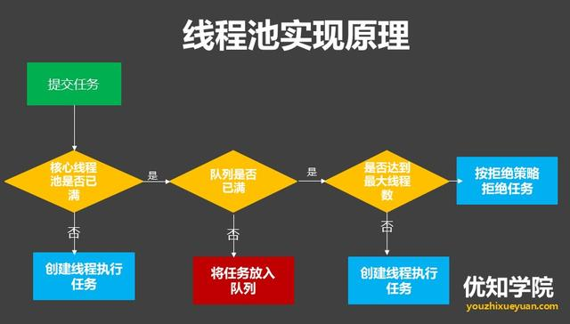

# 1.线程
## 1.1 线程池生命周期

## 1.2 启动线程方法
 * 继承thread类
 * 实现runnable接口
 * 实现callable接口,通过futuretask包装器创建
 * 使用线程池

# 2.线程池
## 常用线程池
JDK线程池ThreadPoolExecutor
JDK定时线程池ScheduledThreadPoolExecutor
Executors-默认线程池参数


## 参数含义
 1. corePoolSize（线程池的基本大小）

    当提交一个任务到线程池时，线程池会创建一个线程来执行任务，即使其他空闲的基本线程能够执行新任务也会创建线程，等到需要执行的任务数大于线程池基本大小时就不再创建。如果调用了线程池的prestartAllCoreThreads方法，线程池会提前创建并启动所有基本线程。
2. runnableTaskQueue（任务队列）

   用于保存等待执行的任务的阻塞队列。可以选择以下几个阻塞队列。
     - ArrayBlockingQueue：是一个基于数组结构的有界阻塞队列，此队列按 FIFO（先进先出）原则对元素进行排序。
     - LinkedBlockingQueue：一个基于链表结构的阻塞队列，此队列按FIFO （先进先出） 排序元素，吞吐量通常要高于ArrayBlockingQueue。
     - SynchronousQueue：一个不存储元素的阻塞队列。每个插入操作必须等到另一个线程调用移除操作，否则插入操作一直处于阻塞状态，吞吐量通常要高于LinkedBlockingQueue。
     - PriorityBlockingQueue：一个具有优先级得无限阻塞队列。

* tips:LinkedBlockingQueue和ArrayBlockingQueue的异同
         
    - 相同：

        1. LinkedBlockingQueue和ArrayBlockingQueue都实现了BlockingQueue接口；

        2. LinkedBlockingQueue和ArrayBlockingQueue都是可阻塞的队列
        
        3. 内部都是使用ReentrantLock和Condition来保证生产和消费的同步；
        4. 当队列为空，消费者线程被阻塞；当队列装满，生产者线程被阻塞；
        5. 使用Condition的方法来同步和通信：await()和signal()

    -  不同:
        1. 锁机制不同
        
        LinkedBlockingQueue中的锁是分离的，生产者的锁PutLock，消费者的锁takeLock
    ```java  
    /** Lock held by take, poll, etc */
    private final ReentrantLock takeLock = new ReentrantLock();

    /** Wait queue for waiting takes */
    private final Condition notEmpty = takeLock.newCondition();

    /** Lock held by put, offer, etc */
    private final ReentrantLock putLock = new ReentrantLock();

    /** Wait queue for waiting puts */
    private final Condition notFull = putLock.newCondition();
    ```
        ArrayBlockingQueue生产者和消费者使用的是同一把锁； 
    ``` java
        /** Main lock guarding all access */
    final ReentrantLock lock;

    /** Condition for waiting takes */
    private final Condition notEmpty;

    /** Condition for waiting puts */
    private final Condition notFull;
   ```
    2. 底层实现机制不同
        LinkedBlockingQueue内部维护的是一个链表结构,在生产和消费的时候，需要创建Node对象进行插入或移除，大批量数据的系统中，其对于GC的压力会比较大
    ```java
     /**
     * Linked list node class
     */
    static class Node<E> {
        E item;

        /**
         * One of:
         * - the real successor Node
         * - this Node, meaning the successor is head.next
         * - null, meaning there is no successor (this is the last node)
         */
        Node<E> next;

        Node(E x) { item = x; }
    }
        /**
     * Head of linked list.
     * Invariant: head.item == null
     */
    transient Node<E> head;

    /**
     * Tail of linked list.
     * Invariant: last.next == null
     */
    private transient Node<E> last;
    ```
       ArrayBlockingQueue内部维护了一个数组,在生产和消费的时候，是直接将枚举对象插入或移除的，不会产生或销毁任何额外的对象实例
    ```java
     /** The queued items */
    final Object[] items;
    ```
    3. 构造时候不同
        
       LinkedBlockingQueue有默认的容量大小为：Integer.MAX_VALUE，当然也可以传入指定的容量大小

       ArrayBlockingQueue在初始化的时候，必须传入一个容量大小的值
    4. 执行clear()方法时不同
       LinkedBlockingQueue执行clear方法时，会加上两把锁fullLock():putLock(),takeLock();

       ArrayBlockingQueue只有lock.
    5. 统计元素个数
    
        LinkedBlockingQueue中使用了一个AtomicInteger对象来统计元素的个数

    　　ArrayBlockingQueue则使用int类型来统计元素
       

3. maximumPoolSize（线程池最大大小）
线程池允许创建的最大线程数。如果队列满了，并且已创建的线程数小于最大线程数，则线程池会再创建新的线程执行任务。值得注意的是如果使用了无界的任务队列这个参数就没什么效果。
4. ThreadFactory：用于设置创建线程的工厂
可以通过线程工厂给每个创建出来的线程设置更有意义的名字，Debug和定位问题时非常有帮助。
5. RejectedExecutionHandler（饱和策略）
当队列和线程池都满了，说明线程池处于饱和状态，那么必须采取一种策略处理提交的新任务。这个策略默认情况下是AbortPolicy，表示无法处理新任务时抛出异常。以下是JDK1.5提供的四种策略。
    AbortPolicy：直接抛出异常。
    CallerRunsPolicy：只用调用者所在线程来运行任务。
    DiscardOldestPolicy：丢弃队列里最近的一个任务，并执行当前任务。
    DiscardPolicy：不处理，丢弃掉。
    当然也可以根据应用场景需要来实现RejectedExecutionHandler接口自定义策略。如记录日志或持久化不能处理的任务。
6. keepAliveTime（线程活动保持时间）
线程池的工作线程空闲后，保持存活的时间。所以如果任务很多，并且每个任务执行的时间比较短，可以调大这个时间，提高线程的利用率。
7. TimeUnit（线程活动保持时间的单位
可选的单位有天（DAYS），小时（HOURS），分钟（MINUTES），毫秒(MILLISECONDS)，微秒(MICROSECONDS, 千分之一毫秒)和毫微秒(NANOSECONDS, 千分之一微秒)。 


# 3.并发包
## 3. 1 J.U.C

### AQS--AbstractQueuedSynchronizer
http://www.cnblogs.com/waterystone/p/4920797.html


CLH和MCS mcs:https://www.cnblogs.com/doit8791/p/9098188.html
### 并发集合---concurrent
//todo
### 原子性--Atomic
//todo

CountDownLatch

信号量-Semaphore


## 3. 2 BlockingQueue--阻塞队列

java.util.concurrent.BlockingQueue 接口有以下阻塞队列的实现：
* FIFO 队列 ：LinkedBlockingQueue、ArrayBlockingQueue（固定长度）

**ArrayBlockingQueue** 基于数组的阻塞队列实现；
内部是通过一个可重入锁ReentrantLock和两个Condition条件对象来实现阻塞，所以ArrayBlockingQueue中的元素存在公平访问与非公平访问的区别
**LinkedBlockingQueue** 一个由链表实现的有界队列阻塞队列，需要设置长度，不然默认值为Integer.MAX_VALUE会造成机器负载或者内存爆满等情况。
链接队列的吞吐量要高于基于数组的队列（ArrayBlockingQueue），因为其内部实现添加和删除操作使用的两个ReenterLock(putLock,takeLock)来控制并发执行，而ArrayBlockingQueue内部只是使用一个ReenterLock控制并发，因此LinkedBlockingQueue的吞吐量要高于ArrayBlockingQueue.
* 优先级队列 ：PriorityBlockingQueue

# 4.synchronized关键字
# 5.volatile关键字

## 多线程开发良好的实践
给线程起个有意义的名字，这样可以方便找 Bug。
缩小同步范围，从而减少锁争用。例如对于 synchronized，应该尽量使用同步块而不是同步方法。
多用同步工具少用 wait() 和 notify()。首先，CountDownLatch, CyclicBarrier, Semaphore 和 Exchanger 这些同步类简化了编码操作，而用 wait() 和 notify() 很难实现复杂控制流；其次，这些同步类是由最好的企业编写和维护，在后续的 JDK 中还会不断优化和完善。
使用 BlockingQueue 实现生产者消费者问题。
多用并发集合少用同步集合，例如应该使用 ConcurrentHashMap 而不是 Hashtable。
使用本地变量和不可变类来保证线程安全。
使用线程池而不是直接创建线程，这是因为创建线程代价很高，线程池可以有效地利用有限的线程来启动任务。