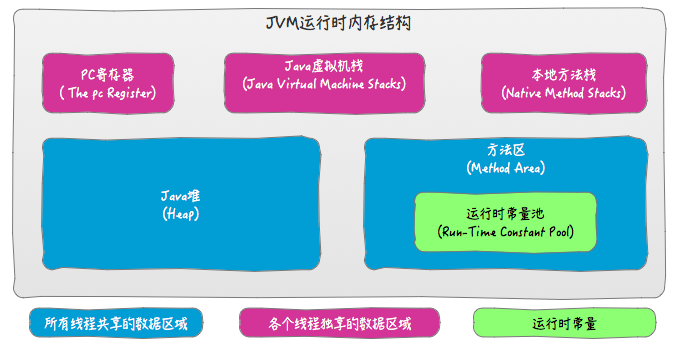
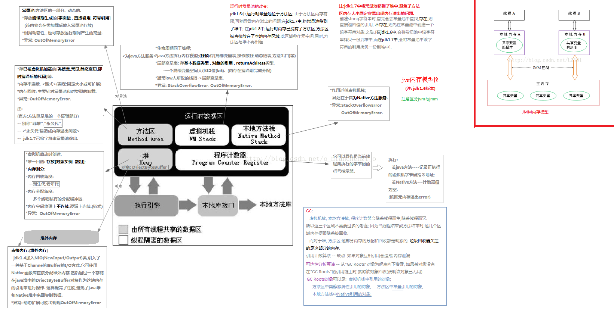
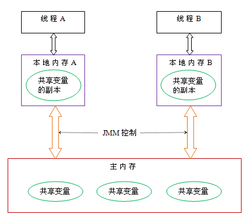

# JVM内存结构
## JVM运行态数据分区(内存结构)

[详解](https://www.cnblogs.com/dingyingsi/p/3760447.html)

## Java内存模型(JMM:Java Memory Model)

>> JMM并不像JVM内存结构一样是真实存在的。他只是一个抽象的概念。JSR-133: Java Memory Model and Thread Specification中描述了，**JMM是和多线程相关的**，他描述了一组规则或规范，这个规范定义了一个线程对共享变量的写入时对另一个线程是可见的。

- Java的多线程之间是通过共享内存进行通信的，而由于采用共享内存进行通信，在通信过程中会存在一系列如可见性、原子性、顺序性等问题，而JMM就是围绕着多线程通信以及与其相关的一系列特性而建立的模型。JMM定义了一些语法集，这些语法集映射到Java语言中就是volatile、synchronized等关键字。

## Java对象模型
>> Java是一种面向对象的语言，而Java对象在JVM中的存储也是有一定的结构的。而这个关于**Java对象自身的存储模型称之为Java对象模型**。
HotSpot虚拟机中，设计了一个OOP-Klass Model。OOP（Ordinary Object Pointer）指的是普通对象指针，而Klass用来描述对象实例的具体类型。
每一个Java类，在被JVM加载的时候，JVM会给这个类创建一个instanceKlass，保存在方法区，用来在JVM层表示该Java类。当我们在Java代码中，使用new创建一个对象的时候，JVM会创建一个instanceOopDesc对象，这个对象中包含了对象头以及实例数据,存储在堆区。

# GC垃圾回收算法
[参考](http://www.cnblogs.com/ityouknow/p/5614961.html)
>> 垃圾收集 Garbage Collection 通常被称为"GC".
   JVM 中，程序计数器、虚拟机栈、本地方法栈都是随线程而生随线程而灭，栈帧随着方法的进入和退出做入栈和出栈操作，实现了自动的内存清理，因此，我们的内存垃圾回收主要集中于**Java堆和方法区**中，在程序运行期间，这部分内存的分配和使用都是动态的

## 对象存活判断
判断对象是否存活一般有两种方式：
- **引用计数**：每个对象有一个引用计数属性，新增一个引用时计数加1，引用释放时计数减1，计数为0时可以回收。此方法简单，无法解决对象相互循环引用的问题。
- **可达性分析(Reachability Analysis)**：从GC Roots开始向下搜索，搜索所走过的路径称为引用链。当一个对象到GC Roots没有任何引用链相连时，则证明此对象是不可用的。不可达对象。

串行
并行
并发
G1并发

# 类加载机制
[详细参考java基础](./Java基础.md)

1. 装载(Load)：查找和加载Class(二进制)文件；
2. 链接(Link)：把类的二进制数据合并到JRE中；
        (a)校验：检查载入Class文件数据的正确性；
        (b)准备：给类的静态变量分配存储空间，并将其初始化为默认值；
        (c)解析：将类中的符号引用转成直接引用；
3. 初始化(Initialize)：对类的静态变量，静态代码块执行初始化操作
4. 使用
5. 卸载

## "双亲委派"机制介绍
JVM在加载类时默认采用的是双亲委派机制。通俗的讲，就是某个特定的类加载器在接到加载类的请求时，首先将加载任务委托给父加载器，依次递归，如果父加载器可以完成类加载任务，就成功返回；只有父加载器无法完成此加载任务时，才自己去加载。

　　

* 启动类加载器：Bootstrap ClassLoader，负责加载存放在JDK\jre\lib(JDK代表JDK的安装目录，下同)下，或被-Xbootclasspath参数指定的路径中的，并且能被虚拟机识别的类库（如rt.jar，所有的java.*开头的类均被Bootstrap ClassLoader加载）。启动类加载器是无法被Java程序直接引用的。
* 扩展类加载器：Extension ClassLoader，该加载器由sun.misc.Launcher$ExtClassLoader实现，它负责加载DK\jre\lib\ext目录中，或者由java.ext.dirs系统变量指定的路径中的所有类库（如javax.*开头的类），开发者可以直接使用扩展类加载器。
* 应用程序类加载器：Application ClassLoader，该类加载器由sun.misc.Launcher$AppClassLoader来实现，它负责加载用户类路径（ClassPath）所指定的类，开发者可以直接使用该类加载器，如果应用程序中没有自定义过自己的类加载器，一般情况下这个就是程序中默认的类加载器。
* 用户自定义类加载器：User ClassLoader，属于应用程序根据自身需要自定义的ClassLoader，如tomcat、jboss都会根据j2ee规范自行实现ClassLoader(继承该类)，加载过程中会先检查类是否被已加载，检查顺序是自底向上，从User ClassLoader到BootStrap ClassLoader逐层检查，只要某个classloader已加载就视为已加载此类，保证此类在所有ClassLoader只加载一次。而加载的顺序是自顶向下，也就是由上层来逐层尝试加载此类。

# 服务响应慢的处理方式：
[参考操作系统](服务慢(无响应)排查方法)
http://www.importnew.com/27436.html
heap dump查看：https://www.cnblogs.com/jingmoxukong/p/5509196.html
java 产生core文件：kill -3 pid
一般来说，需要获取的信息大概分几类：
1. 服务表现：问题的具体表现（出错、超时等）、应用日志、依赖服务的状态等
2. 系统状态：操作系统指标（系统管理的各种资源的状态(端口连接数，服务连接数)、系统日志等）、jvm指标（主要是gc）
3. 硬件指标：cpu、内存、网络、硬盘是否达到瓶颈

# 虚拟机性能监控和故障处理
jstat
jmap
jstack

heap dump： jmap ， kill -3 pid
