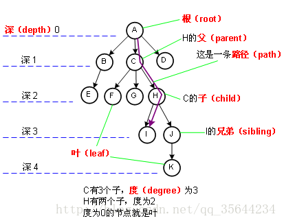

# 常见数据结构记录
* 数据结构：
数据结构是指相互之间存在一种或多种特定关系的数据元素的集合。再简单描述一下：数据结构就是描述对象间逻辑关系的学科。
* 数据存储结构：
   简单的讲就是数据在计算机中的存储方式。
>> 常用的数据存储方式有两种：顺序存储，非顺序存储。顺序存储就是把数据存储在一块连续的存储介质（硬盘或内存等）中。反之就是非顺序存储。Java中的**数组就是典型的顺序存储**，链表就是非顺序存储。数组存储数据时会开辟出一块连续内存，按顺序存储。链表不会先开辟出一块内存来，而是只需要知道下一个节点存储的位置，就能把所有的数据连起来了。所以单向链表的最后一个节点是指向Null的。

## 数组
数组是数据结构中很基本的结构，很多编程语言都内置数组。

当创建数组时会在内存中划分出一块连续的内存，然后当有数据进入的时候会将数据按顺序的存储在这块连续的内存中。

因为数组在存储数据时是按顺序存储的，存储数据的内存也是连续的，所以他的特点就是**寻址读取数据比较容易，插入和删除比较困难**。

## 链表-linked list
链表是一种物理存储单元上非连续、非顺序的存储结构，数据元素的逻辑顺序是通过链表中的指针链接次序实现的。链表的类型有多种：单链表，双链表，有序链表和循环链表。

创建链表的过程和创建数组的过程不同，不会先划出一块连续的内存。因为链表中的数据并不是连续的，链表在存储数据的内存中有两块区域，一块区域用来存储数据，一块区域用来记录下一个数据保存在哪里（指向下一个数据的指针）。

由于链表是以这种方式保存数据，所以链表在插入和删除时比较容易，读取数据时比较麻烦

## 堆-Heap
堆的物理存储结构是一维数组，逻辑存储结构是完全二叉树。

## 栈-stack
允许插入和删除的一端称为栈顶（top），另一端称为栈底（bottom）；

栈是一种**先进后出（FILO）**的数据结构，数组和链表都可以生成栈。
当数据压入栈时会按照规则压入到栈的底部（push），出栈时会取栈顶数据（pop）。

## 队列-queue
队列是一种先进先出（FIFO）的数据结构，数组和链表也都可以生成队列。当数据进入到队列中时加入到队尾（tail），但是出队列的时候是从头端（head）取数据。

## hash表
[参考](https://blog.csdn.net/snailmann/article/details/80435311)
* 哈希表(Hash Table)又称为散列表。哈希表是一种可以根据以key-value键值对形式存储数据的数据结构，可以通过关键字Key直接找到数据Value的存储位置，而不需要经过任何的遍历和比较。

* 关键字(Key) 
哈希表是通过一个信息来查找另一个信息，将这两个信息在哈希表从形成映射关系，而关键字则是我们要提供的信息
* 值(Value) 
值是我们想要获取到的信息
* 哈希函数 
哈希函数是用来构成哈希表的工具，也是哈希表的核心思想，是关键字和对应数据的存储位置的一个映射关系，通过把关键字代入哈希函数中进行计算，可以得到关键字所对应的数据在哈希表中的存储位置
* 哈希地址 
哈希地址记录的是我们所需要的数据在哈希表中的存储位置，哈希地址只是表示查找表中的存储位置，不是实际的物理存储位置
### 一致性hash算法
不带虚节点hash
待虚节点hash
 https://www.cnblogs.com/lpfuture/p/5796398.html

### 哈希冲突解决办法
1. 开放地址法：包括：线性探测法，二次探测法，伪随机数探测法；
2. 链地址法（拉链法，位桶法）：产生hash冲突后在存储数据后面加一个指针，指向后面冲突的数据；jdk hashmap就是使用的这种方法；
3. 再散列（哈希）法；
4. 公共溢出区。

## 树
[参考](http://blog.jobbole.com/111680)

树是使用了递归定义的数据结构，树的子树还是树，其结构如下图所示： 
 

* 度：结点拥有的子树数目，例如上图结点A的度为3，结点E的度为0
* 叶子或终端结点：度为0的结点（没有子树的结点）
* 树的度：各个结点中度的最大值
* 孩子：结点的子树的根，称为根的孩子
* 层次：根的层次为0，根的孩子为1，以此类推
* 深度：树中结点的最大层次，称为树的深度

### 二叉树(Binary Tree)
* 定义：二叉树的每个结点至多只有二棵子树(不存在度大于2的结点)，二叉树的子树有左右之分，次序不能颠倒。
* 满二叉树：除最后一层无任何子节点外，每一层上的所有结点都有两个子结点。也可以这样理解，除叶子结点外的所有结点均有两个子结点。节点数达到最大值，所有叶子结点必须在同一层上。
* 完全二叉树：若设二叉树的深度为h，除第 h 层外，其它各层 (1～(h-1)层) 的结点数都达到最大个数，第h层所有的结点都连续集中在**最左边**，这就是完全二叉树。

* 二叉树的特性：
1. 在非空二叉树中，二叉树的第i层至多有2^(i-1)个结点，i>=1；
2. 深度为k的二叉树至多有(2^k)-1个结点(k>=1)，最少有k个节点；
3. 对任何一棵二叉树T，如果其终端结点(叶子节点)数为n0，度数为2的结点总数为n2，则n0=n2+1。
4. 具有n个节点的完全二叉树的深度为log2(n+1);
5.

### 二叉查找树(Binary Search Tree)
* 二叉查找树定义：又称为是二叉排序树（Binary Sort Tree）或二叉搜索树。二叉排序树或者是一棵空树，或者是具有下列性质的二叉树：
1. 若左子树不空，则左子树上所有结点的值均小于它的根结点的值；
2. 若右子树不空，则右子树上所有结点的值均大于或等于它的根结点的值；
3. 左、右子树也分别为二叉排序树；
4. 没有键值相等的节点。

* 二叉查找树的性质：**对二叉查找树进行中序遍历，即可得到有序的数列**。

tips: 其期望高度（即为一棵平衡树时）为log2n，其各操作的时间复杂度O(log2n)同时也由此而决定。但是，在某些极端的情况下（如在插入的序列是有序的时），二叉搜索树将退化成近似链或链，此时，其操作的时间复杂度将退化成线性的，即O(n)。
为了解决二叉查找树退化为单链表时查找效率低下的问题，引入了平衡二叉树(AVL，人名)。

### 平衡二叉树(Balanced Binary Tree)
平衡二叉树又被称为AVL树（有别于AVL算法），
* 平衡二叉树具有以下性质：
1. 它是一棵空树或父节点的左右两棵子树的高度差的绝对值不超过1，
2. 左右两个子树都是一棵平衡二叉树。平衡二叉树的常用算法有红黑树、AVL树等。
* 从平衡二叉树的性质可知，平衡二叉树就是避免了二叉查找树退化为单链表的极端情况。二叉查找树的查找、插入、删除较好时间复杂度是O(log n)，最差是O(n)。*二叉平衡树保证查找、插入、删除的时间复杂度稳定在O(log n)下*。

#### 平衡查找树之AVL树
* 在AVL中任何节点的两个儿子子树的高度最大差别为1，所以它也被称为高度平衡树，n个结点的AVL树最大深度约1.44log2n。查找、插入和删除在平均和最坏情况下都是O(logn)。（但是频繁旋转会使插入和删除牺牲掉O(logN)左右的时间，不过相对二叉查找树来说，时间上稳定了很多）

* AVL树的自平衡操作——旋转：AVL树最关键的也是最难的一步操作就是旋转。旋转主要是为了实现AVL树在实施了插入和删除操作以后，树重新回到平衡的方法。

#### 平衡二叉树之红黑树
* 红黑树的定义：红黑树是一种自平衡二叉查找树，是在计算机科学中用到的一种数据结构，典型的用途是实现关联数组。

* 红黑树的性质：
红黑树是每个节点都带有颜色属性的二叉查找树，颜色为红色或黑色。在二叉查找树强制的一般要求以外，对于任何有效的红黑树我们增加了如下的额外要求:
性质1. 节点是红色或黑色。
性质2. 根是黑色。
性质3. 所有叶子都是黑色（叶子是NIL节点）。
性质4. 每个红色节点必须有两个黑色的子节点。(从每个叶子到根的所有路径上不能有两个连续的红色节点。)
性质5. 从任一节点到其每个叶子的所有简单路径都包含相同数目的黑色节点。

### B树：平衡多路查找树
* B树也是一种用于查找的平衡树，但是它不是二叉树。
* B树的定义:
B树（B-tree）是一种树状数据结构，能够用来存储排序后的数据。这种数据结构能够让查找数据、循序存取、插入数据及删除的动作，都在对数时间内完成。B树，概括来说是一个一般化的二叉查找树，**可以拥有多于2个子节点**。与自平衡二叉查找树不同，B-树为系统最优化大块数据的读和写操作。B-tree算法减少定位记录时所经历的中间过程，从而加快存取速度。这种数据结构常被应用在数据库和文件系统的实作上。

* B树作为一种多路搜索树（并不是二叉的）：
1) 定义任意非叶子结点最多只有**M**个儿子；且M>2；
2) 根结点的儿子数为[2, M]；
3) 除根结点以外的非叶子结点的儿子数为[M/2, M]；
4) 每个结点存放至少M/2-1（取上整）和至多M-1个关键字；（至少2个关键字）
5) 非叶子结点的关键字个数=指向儿子的指针个数-1；
6) 非叶子结点的关键字：K[1], K[2], …, K[M-1]；且K[i] < K[i+1]；
7) 非叶子结点的指针：P[1], P[2], …, P[M]；其中P[1]指向关键字小于K[1]的子树，P[M]指向关键字大于K[M-1]的子树，其它P[i]指向关键字属于(K[i-1], K[i])的子树；
8) 所有叶子结点位于同一层；

[B树示例](../java/pic/B树.jpg)

### B+树
* B+树是B树的变体，也是一种多路搜索树：
* 其定义基本与B-树相同，除了：
1. 非叶子结点的子树指针与关键字个数相同；
2. 非叶子结点的子树指针P[i]，指向关键字值属于[K[i], K[i+1])的子树（B-树是开区间）；
3. 为所有叶子结点增加一个链指针；
4. 所有关键字都在叶子结点出现；

[B+树的示意图](../java/pic/B+树.jpg)

B+树的搜索与B树也基本相同，区别是**B+树只有达到叶子结点才命中**（B树可以在非叶子结点命中），其性能也等价于在关键字全集做一次二分查找；

### B*树
* B*树是B+树的变体，在B+树的非根和非叶子结点再增加指向兄弟的指针，将结点的最低利用率从1/2提高到2/3。

[B*树的示意图](../java/pic/B+树.jpg)

B\*树定义了非叶子结点关键字个数至少为(2/3)\*M，即块的最低使用率为2/3（代替B+树的1/2）；
所以，B*树分配新结点的概率比B+树要低，空间使用率更高。

### 字典树（Trie）
* Tire树称为字典树，又称单词查找树，Trie树，是一种树形结构，是一种哈希树的变种。典型应用是用于统计，排序和保存大量的字符串（但不仅限于字符串），所以经常被搜索引擎系统用于文本词频统计。**它的优点是：利用字符串的公共前缀来减少查询时间，最大限度地减少无谓的字符串比较，查询效率比哈希树高。**
* Tire树的三个基本性质：
1. 根节点不包含字符，除根节点外每一个节点都只包含一个字符；
2. 从根节点到某一节点，路径上经过的字符连接起来，为该节点对应的字符串；
3. 每个节点的所有子节点包含的字符都不相同。

# 算法
用的最多的是排序和遍历（树，链表等）
//todo  排序

目前各种数据库中比较常使用的数据结构就是**B树**、**跳跃表SkipList**、**FST**，对于数据结构来说没有最好的，而是针对于各种业务场景更适合的。

* MySQL InnoDB索引 使用的数据结构是B+树，B+树是一种多路平衡查找树，查找复杂度是log(N)，优点是外存索引，更新方便，快但是存储空间大，查询速度相对较慢。MySQL 这种关系型数据库，对实时性要求特别高，要求写入后能够立马检索到，因此采用B+树更为合适。

* 跳跃表：结构简单，级数可控，但是对模糊查询支持不太好，lucene3.x以下使用。Redis和levelDb也使用到。

* FST：使用字典树（Trie），是es当前使用的数据结构，共享前缀支持模糊查询，但是其构造过程要求输入有序，索引过程较慢。对于es来说，适用的场景并不要求写入后能够立马能查询到，而是在满足业务需求的一定时间范围内能查询到，而对数据的查询速度有更高的要求，因此使用FST作为数据结构。
