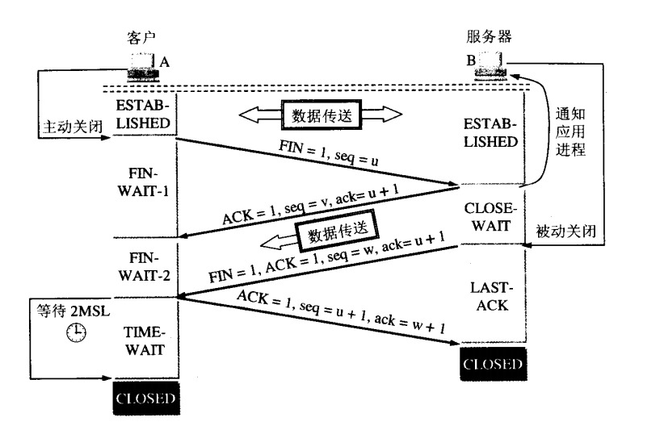

- [网络基础知识](#%E7%BD%91%E7%BB%9C%E5%9F%BA%E7%A1%80%E7%9F%A5%E8%AF%86)
  - [分层](#%E5%88%86%E5%B1%82)
    - [五层协议的体系架构](#%E4%BA%94%E5%B1%82%E5%8D%8F%E8%AE%AE%E7%9A%84%E4%BD%93%E7%B3%BB%E6%9E%B6%E6%9E%84)
      - [1.应用层(application layer)](#1%E5%BA%94%E7%94%A8%E5%B1%82application-layer)
        - [域名系统（Domain Name System缩写DNS）](#%E5%9F%9F%E5%90%8D%E7%B3%BB%E7%BB%9Fdomain-name-system%E7%BC%A9%E5%86%99dns)
        - [HTTP协议](#http%E5%8D%8F%E8%AE%AE)
      - [2.运输层(transport layer)](#2%E8%BF%90%E8%BE%93%E5%B1%82transport-layer)
        - [传输控制协议TCP(Transmisson Control Protocol) --提供面向连接的，可靠的数据传输服务。](#%E4%BC%A0%E8%BE%93%E6%8E%A7%E5%88%B6%E5%8D%8F%E8%AE%AEtcptransmisson-control-protocol---%E6%8F%90%E4%BE%9B%E9%9D%A2%E5%90%91%E8%BF%9E%E6%8E%A5%E7%9A%84%E5%8F%AF%E9%9D%A0%E7%9A%84%E6%95%B0%E6%8D%AE%E4%BC%A0%E8%BE%93%E6%9C%8D%E5%8A%A1)
        - [用户数据协议UDP(User Datagram Protocol) -- 提供无连接的，尽最大努力的数据传输服务（不保证数据传输的可靠性）](#%E7%94%A8%E6%88%B7%E6%95%B0%E6%8D%AE%E5%8D%8F%E8%AE%AEudpuser-datagram-protocol----%E6%8F%90%E4%BE%9B%E6%97%A0%E8%BF%9E%E6%8E%A5%E7%9A%84%E5%B0%BD%E6%9C%80%E5%A4%A7%E5%8A%AA%E5%8A%9B%E7%9A%84%E6%95%B0%E6%8D%AE%E4%BC%A0%E8%BE%93%E6%9C%8D%E5%8A%A1%E4%B8%8D%E4%BF%9D%E8%AF%81%E6%95%B0%E6%8D%AE%E4%BC%A0%E8%BE%93%E7%9A%84%E5%8F%AF%E9%9D%A0%E6%80%A7)
      - [3 网络层(network layer)](#3-%E7%BD%91%E7%BB%9C%E5%B1%82network-layer)
      - [4 数据链路层(data link layer)](#4-%E6%95%B0%E6%8D%AE%E9%93%BE%E8%B7%AF%E5%B1%82data-link-layer)
      - [5 物理层(physical layer)](#5-%E7%89%A9%E7%90%86%E5%B1%82physical-layer)
  - [网络请求产生协议](#%E7%BD%91%E7%BB%9C%E8%AF%B7%E6%B1%82%E4%BA%A7%E7%94%9F%E5%8D%8F%E8%AE%AE)
  - [get和post区别](#get%E5%92%8Cpost%E5%8C%BA%E5%88%AB)
  - [HTTPS](#https)
- [tcp和udp的区别](#tcp%E5%92%8Cudp%E7%9A%84%E5%8C%BA%E5%88%AB)
- [三次握手](#%E4%B8%89%E6%AC%A1%E6%8F%A1%E6%89%8B)
- [四次挥手](#%E5%9B%9B%E6%AC%A1%E6%8C%A5%E6%89%8B)
- [epoll与select的区别](#epoll%E4%B8%8Eselect%E7%9A%84%E5%8C%BA%E5%88%AB)
  - [MMAP](#mmap)
- [epoll中et和lt的区别与实现原理](#epoll%E4%B8%ADet%E5%92%8Clt%E7%9A%84%E5%8C%BA%E5%88%AB%E4%B8%8E%E5%AE%9E%E7%8E%B0%E5%8E%9F%E7%90%86)

# 网络基础知识
[参考](https://www.imooc.com/article/48819)
## 分层
;
### 五层协议的体系架构
#### 1.应用层(application layer)
**应用层的任务是通过应用进程间的交互来完成特定网络应用**。应用层协议定义的是应用进程（进程：主机中正在进行的程序）间的通信和交互的规则。在互联网中应用层协议很多，如：**域名系统DNS**, 支持万维网应用的**HTTP协议**，支持电子邮件的**SMTP协议**等等。

##### 域名系统（Domain Name System缩写DNS）
域名系统是因特网的一项核心服务，它作为可以将域名和IP地址相互映射的一个分布式数据库，能够使人更方便的访问互联网，而不用去记住能够被机器直接读取的IP数串。

##### HTTP协议
超文本传输协议(HTTP：HyperText Transfer Protocol）是互联网上应用最为广泛的一种网络协议。所有的WWW文件都是必须遵守这个标准。
HTTP协议是一个基于请求与响应模式的、无状态的、应用层的协议，常基于TCP的连接方式，
HTTP1.1版本中给出一种持续连接的机制，绝大多数的Web开发，都是构建在HTTP协议之上的Web应用。

http请求由三部分组成，分别是：请求行、消息报头、请求正文
- 请求报文包含三部分：
a、请求行：包含请求方法、URI、HTTP版本信息
b、请求首部字段
c、请求内容实体
- 响应报文包含三部分：
a、状态行：包含HTTP版本、状态码、状态码的原因短语
b、响应首部字段
c、响应内容实体

#### 2.运输层(transport layer)
**运输层的主要任务就是负责向两台主机进程之间的通信提供通用的数据传输服务。**
应用进程利用该服务传送应用层报文。所谓复用就是指多个应用层进程可同时使用下面运输层的服务，所谓分用是传输层把收到的信息分别交付上面应用层中的相应进程。
运输层主要使用一下两种协议
##### 传输控制协议TCP(Transmisson Control Protocol) --提供面向连接的，可靠的数据传输服务。
- TCP的主要特点：
  1. TCP是面向连接的；（就好像打电话一样，通话前需要先拨号建立连接，通话结束后要挂机释放连接）
  2. 每一条TCP连接只能有两个端点，每一条TCP连接只能是点对点的（一对一）；
  3. TCP提供可靠交付的服务。通过TCP连接传送的数据，无差错，不丢失，不重复，并且按序到达；
  4. TCP提供全双工通信。TCP允许通信双方的应用进程在任何时候都能发送数据。TCP连接的两端都设有发送缓存和接收缓存，用来临时存放双方通信的数据；
  5. 面向字节流。TCP中的"流"（stream）值的是流入进程或从进程流出的字节序列。"面向字节流"的含义是：虽然应用程序和TCP的交互寺一次一个数据块（大小不等），但TCP把应用程序交下来的数据仅仅看成是一连串的无结构的字节流。

##### 用户数据协议UDP(User Datagram Protocol) -- 提供无连接的，尽最大努力的数据传输服务（不保证数据传输的可靠性）
- UDP的主要特点：
  1. UDP是无连接的；
  2. UDP使用尽最大努力交付，即不保证可靠交付，因此主机不需要维持复杂的连接状态（这里面有许多参数）；
  3. UDP是面向报文的；
  4. UDP没有阻塞控制，因此网络出现拥塞不会使源主机的发送效率降低（对实时应用很有用，如IP电话，实时视频会议等）；
  5. UDP支持一对一，一对多，多对一和多对多的交互通信；
  6. UDP的首部开销小，只有8个字节，比TCP的20字节的首部要短。

#### 3 网络层(network layer)
**网络层负责为分组交换网上的不同主机提供通信服务**。在发送数据时，网络层把运输层产生的报文段或用户数据封装成分组和包进行传送。在**TCP/IP体系机构**中，由于网络层使用**IP协议**，因此分组也叫IP数据报，简称**数据报**
tips:**不要把运输层的“用户数据报UDP”和网络层的“IP数据报”弄混**。
网络层另一个任务就是选择合适的路由，使源主机传输层所传下来的分组，能通过网络层中的路由器找到目的主机。
互联网使用的网络层协议是无连接的网际协议（Intert Prococol）和许多路由选择协议，因此互联网的网络层也叫做**网际层或IP层**。

#### 4 数据链路层(data link layer)
**数据链路层通常简称为链路层。两台主机之间的数据传输，总是在一段一段的链路上传送的，这就是需要使用专门的链路层的协议**。 在两个相邻节点之间传送数据时，**数据链路层将网络层交下来的IP数据报组装成帧**，在两个相邻节点间的链路上传送帧。每一帧包括数据和必要的控制信息（如同步信息，地址信息，差错控制等）。

#### 5 物理层(physical layer)
在物理层上所传送的数据单位是比特。
**物理层的作用是实现相邻计算机节点之间比特流的透明传送，尽可能屏蔽掉具体传输介质和物理设备的差异**。

## 网络请求产生协议
[网络请求产生协议](../java/pic/网络请求产生协议.png)
## get和post区别
- 区别一：
get重点在从服务器上获取资源，post重点在向服务器发送数据；
- 区别二：
get传输数据是通过URL请求，以field（字段）= value的形式，置于URL后，并用"?"连接，多个请求数据间用"&"连接，如http://127.0.0.1/Test/login.action?name=admin&password=admin，这个过程用户是可见的；
post传输数据通过Http的post机制，将字段与对应值封存在请求实体中发送给服务器，这个过程对用户是不可见的；
- 区别三：
Get传输的数据量小，因为受URL长度限制，但效率较高；
Post可以传输大量数据，所以上传文件时只能用Post方式；
- 区别四：
get是不安全的，因为URL是可见的，可能会泄露私密信息，如密码等；
post较get安全性较高；
- 区别五：
get方式只能支持ASCII字符，向服务器传的中文字符可能会乱码。
post支持标准字符集，可以正确传递中文字符。
## HTTPS
HTTPS就是HTTP加上加密处理（一般是SSL安全通信线路）+认证+完整性保护

# tcp和udp的区别
TCP：是面向连接的流传输控制协议，具有高可靠性，确保传输数据的正确性，有验证重发机制，因此不会出现丢失或乱序。
UDP：是无连接的数据报服务，不对数据报进行检查与修改，无须等待对方的应答，会出现分组丢失、重复、乱序，但具有较好的实时性，UDP段结构比TCP的段结构简单，因此网络开销也小。
[TCPUDP区别.png](../java/pic/TCPUDP区别.png)
# 三次握手

# 四次挥手

# epoll与select的区别
select在一个进程中打开的最大fd是有限制的，由FD_SETSIZE设置，默认值是1024。不过 epoll则没有这个限制，它所支持的fd上限是最大可以打开文件的数目，这个数字一般远大于1024，一般来说内存越大，fd上限越大，1G内存都能达到大约10w左右。
select的轮询机制是系统会去查找每个fd是否数据已准备好，当fd很多的时候，效率当然就直线下降了，epoll采用**基于事件的通知方式**，一旦某个fd数据就绪时，内核会采用类似callback的回调机制，迅速激活这个文件描述符，而不需要不断的去轮询查找就绪的描述符，这就是epoll高效最本质的原因。
无论是select还是epoll都需要内核把FD消息通知给用户空间，如何避免不必要的内存拷贝就很重要，在这点上，epoll是通过内核于用户空间mmap同一块内存实现的，而select则做了不必要的拷贝

## MMAP
https://blog.csdn.net/yusiguyuan/article/details/23388771
内存映射，**简而言之就是将用户空间的一段内存区域映射到内核空间**，映射成功后，用户对这段内存区域的修改可以直接反映到内核空间，同样，内核空间对这段区域的修改也直接反映用户空间。那么对于内核空间<---->用户空间两者之间需要大量数据传输等操作的话效率是非常高的。

# epoll中et和lt的区别与实现原理
LT(level trigger)：水平触发，效率会低于ET触发，尤其在大并发，大流量的情况下。但是LT对代码编写要求比较低，不容易出现问题。LT模式服务编写上的表现是：只要有数据没有被获取，内核就不断通知你，因此不用担心事件丢失的情况。
ET(edge trigger)：边缘触发，效率非常高，在并发，大流量的情况下，会比LT少很多epoll的系统调用，因此效率高。但是对编程要求高，需要细致的处理每个请求，否则容易发生丢失事件的情况。

https://blog.csdn.net/qzcsu/article/details/72861891

[参考引用](https://blog.csdn.net/windows_nt/article/details/28670519,
https://www.cnblogs.com/midiyu/p/7875574.html)

